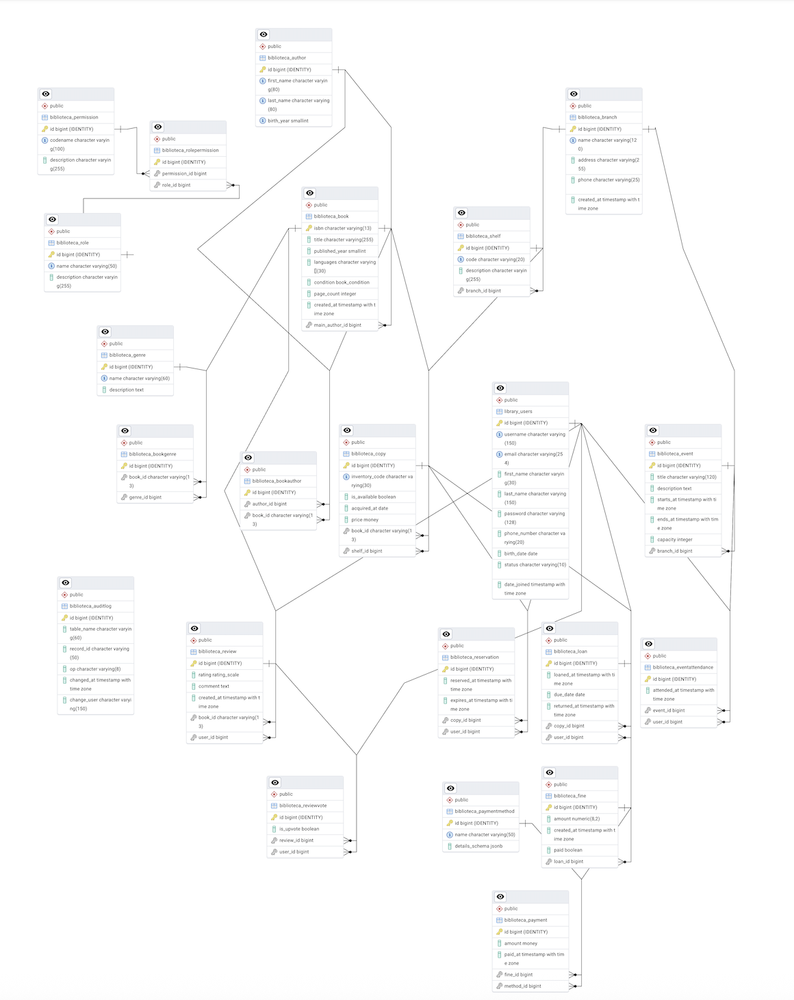

# Proyecto 4 con Django y PostgreSQL

## Descripción
Proyecto de ejemplo para gestionar un sistema de biblioteca, a traves de cruds con indices de vistas personalizadas y datos de ejemplo, usando Django ORM y PostgreSQL.

## Requisitos
- **Python** 3.x
- **Django** (>= 3.x)
- **PostgreSQL** (>= 12)
- **psycopg2-binary** (para la conexión de Django a PostgreSQL)

## Instalación
1. Clona el repositorio:
   ```bash
   git clone https://github.com/Ultimate-Truth-Seeker/Proyecto4BD.git
   cd Proyecto4BD
   ```
2. Crea y activa un entorno virtual:
   ```bash
   python -m venv env
   source env/bin/activate    # Linux/macOS
   env\Scripts\activate     # Windows
   ```
3. Instala las dependencias:
   ```bash
   pip install Django psycopg2-binary
   ```

## Configuración de la base de datos
En `settings.py`, ajusta el diccionario `DATABASES` con tus credenciales:
```python
DATABASES = {
    'default': {
        'ENGINE': 'django.db.backends.postgresql',
        'NAME': '<nombre_bd>',
        'USER': '<usuario>',
        'PASSWORD': '<contraseña>',
        'HOST': 'localhost',
        'PORT': '5432',
    }
}
```

## Migraciones y ejecución
Aplicar migraciones y levantar el servidor de desarrollo:
```bash
python manage.py migrate
python manage.py runserver
```
Accede en el navegador a 
`http://127.0.0.1:8000/catalogo/`
`http://127.0.0.1:8000/prestamos/`
`http://127.0.0.1:8000/sucursales/` 
para ver la aplicación.

## Población de datos
Para cargar datos de ejemplo, ejecuta el script SQL:
```bash
psql -U <usuario> -d <nombre_bd> -f data.sql
```

## Diagrama ERD



